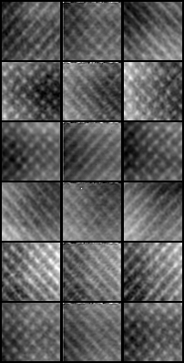
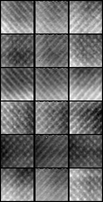
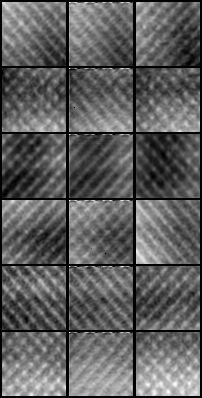
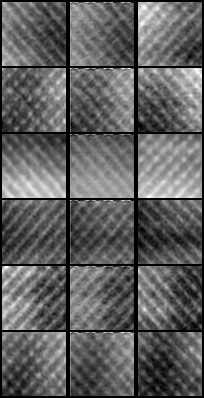

# PixelCNN-Interpolation
__Using PixelCNN to interpolate between medical imaging slices__

This is a work in progress. The idea for the initial implementation was to only use PixelCNN to "Guess" what should be inbetween the slices.  The following is what came from some inital results using phantom data:

2048 epochs             |  4096 epochs             |  6144 epochs             |  8192 epochs             |
:-------------------------:|:-------------------------:|:-------------------------:|:-------------------------:
  |    |    |  

Note: The middle columns contains the generated images.  The model was trained with a slice thickness of 1.5mm and these examples where generated on unseen data with a slice thickness of 3mm.  Qaulitatively it's hard to see the difference past 2048 epochs, but I noticed that random specs seem to disapear after 6144 epochs.

## Issues

There are two big problems with these generated images (Fixed One).

  1. The model has trouble generating material low in houndsfield units in things like Plethora, spiculation, and the fisher line.  This could be fixed with the updated model.  Will test again on MI data once finished with the assesment using the phantom dataset.
  1. Qualitatively, it appears to be learning texture (which is the goal), but the textures still come out a bit to noisy.  Kind of like the frequecy of the wavelengths are there, but amplitudes are too strong.  I think this is because missalignement from the bottom and top layers to the guessed pixel values of the middle layer??? (I believe this is solved, changing the order of the inputs so that the target slice is predicted last, also deeper network and longer training.)

Note: That one might guess since it's auto-regressive it could just be continuing the same noisy pattern because that's what it started with, but that shouldn't be the case.  Because the model has the top and bottom layer patterns to attempt to keep in line with.

## Additional Work

  1. I still need to implement validation during training to check for overfitting
  1. Need to try implementing what I call a Partially Causal PixelCNN (PC-PixelCNN)
  1. Could still potentially try this method on 2D data for super resolution.
  1. Addition of VQVAE to pass inputs into the PixelCNN (This is a lower prioty than intially thought)
