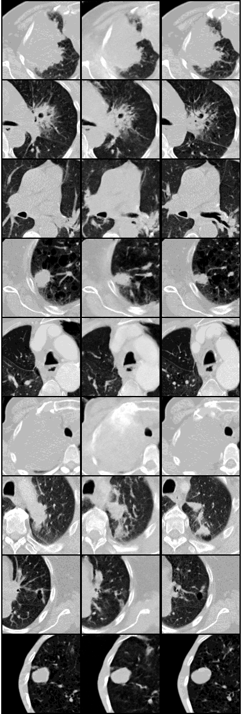

# PixelCNN-Interpolation
__Using PixelCNN to interpolate between medical imaging slices__

This is a work in progress. The idea for the initial implementation was to only use PixelCNN to "Guess" what should be inbetween the slices.  The following is what came from the inital results:

Note: The middle column contains the generated images

## Issues

There are two big problems with these generated images.

  1. The model has trouble generating material low in houndsfield units in things like Plethora, spiculation, and the fisher line.
  1. Qualitatively, it appears to be learning texture (which is the goal), but the textures still come out a bit to noisy.  Kind of like the frequecy of the wavelengths are there, but amplitudes are too strong.  I think this is because missalignement from the bottom and top layers to the guessed pixel values of the middle layer???

Note: That one might guess since it's auto-regressive it could just be continuing the same noisy pattern because that's what it started with, but that shouldn't be the case.  Because the model has the top and bottom layer patterns to attempt to keep in line with.

## Solution

Feed additional information into the PixelCNN via inputs.  VQ-VAE fits nicely in this arena since that's exactly what it was designed for.  A VQ-VAE can be used to generate a latent vector guesses what should be in that middle slice, but at lower level details like structure shape and structure intensities levels.  This can be done either by generating the three slices or generting only the middle.  The viability of this method could also be tested by cheating and and gernerating images and INCLUDING the middle slice, which in turn would feed the ground truth information into the PixelCNN.
